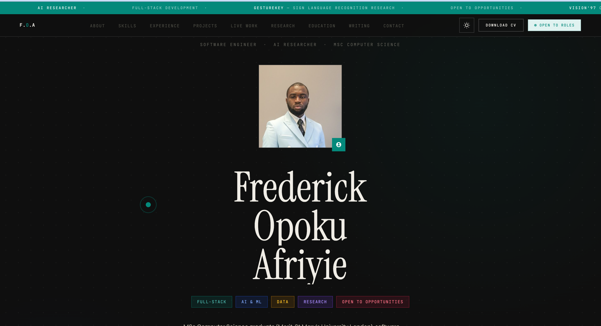
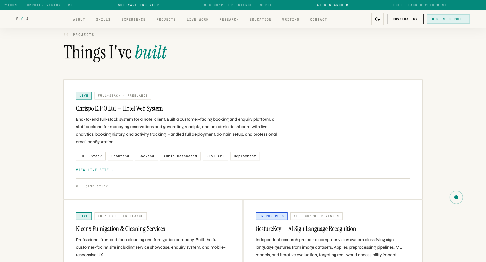
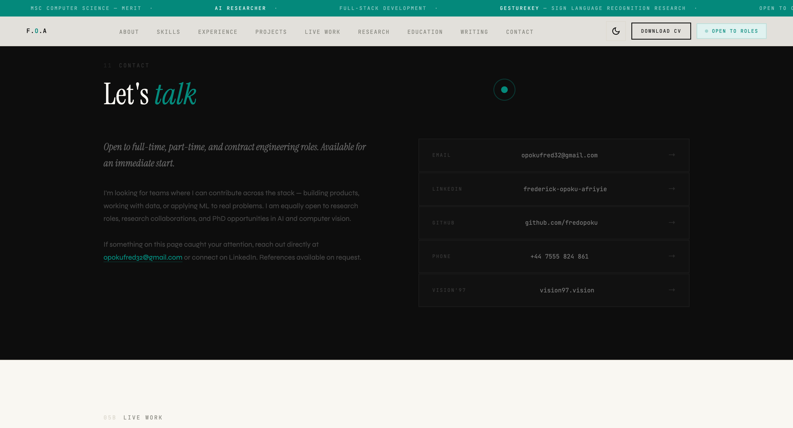

# 🌐 My Portfolio — Personal Portfolio Website

> A simple and clean personal portfolio website showcasing my skills, projects, and experience.


---

## 📌 Overview

This is my personal portfolio website — a digital space where I showcase who I am, what I do, and the projects I've built. Designed and developed from scratch using HTML, CSS, and JavaScript, it serves as my online presence for potential employers, collaborators, and the wider developer community.

---

## ✨ Features

- 👤 **About Me** — Introduction to my background, interests, and goals
- 🛠️ **Skills** — Overview of my technical skills and tools
- 💼 **Projects** — Showcases of my key projects with descriptions and links
- 📬 **Contact** — Easy way for visitors to get in touch
- 📱 Responsive design — works across desktop and mobile devices

---

## 📸 Screenshots

> Add your screenshots to an `assets/` folder in your repo and update the paths below.

| Home / Hero Section | Projects Section | Contact Section |
|---|---|---|
|  |  |  |

---

## 🛠️ Tech Stack

| Category | Tool |
|---|---|
| Structure | HTML5 — 96% |
| Styling | CSS3 — 3.5% |
| Interactivity | JavaScript — 0.5% |

---

## 📁 Project Structure

```
My-portfolio/
├── Files/
│   ├── index.html       # Main portfolio page
│   ├── style.css        # Stylesheet
│   └── script.js        # JavaScript interactions
└── README.md
```

---

## 🚀 Getting Started

No dependencies or build tools required — just open in your browser.

```bash
# 1. Clone the repository
git clone https://github.com/fredopoku/My-portfolio.git
cd My-portfolio

# 2. Open in your browser
open Files/index.html
```

Or simply double-click `index.html` to view it locally.

---

## 🔗 Live Demo

> *Coming soon — deploy via GitHub Pages for a live link!*

To deploy on GitHub Pages:
1. Go to **Settings** → **Pages**
2. Set the source branch to `main` and folder to `/Files`
3. Your portfolio will be live at `https://fredopoku.github.io/My-portfolio`

---

## 🤝 Contributing

Have suggestions to improve the portfolio? Feel free to open an issue or submit a pull request.

---

## 👤 Author

**Frederick Opoku Afriyie**
GitHub: [@fredopoku](https://github.com/fredopoku)

---

*Built with passion and a lot of ☕*
